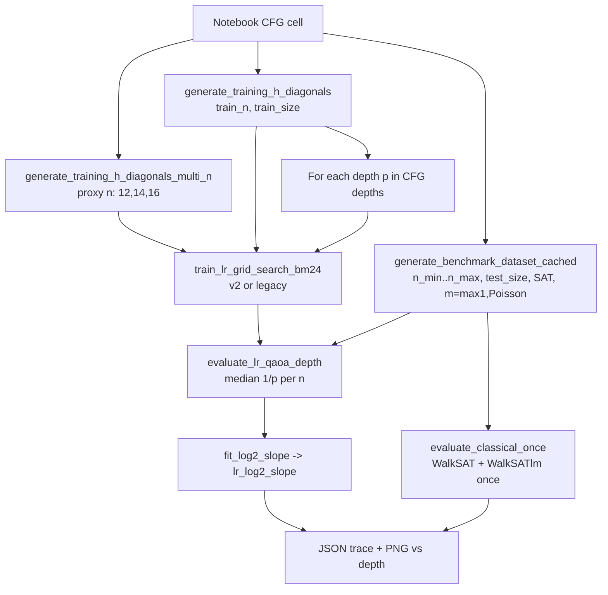

# LR-QAOA depth scaling benchmark — workflow handoff for external review

**Purpose:** Single document to upload to Claude (or similar) instead of many large repo files.  
**Snapshot date:** 2026-05-25. **Do not treat as live source** — originals may change during runs.

---

## 1. Goal of the experiment

Produce the plot **log₂ slope of median(1/p_succ) vs n** as a function of **QAOA depth p**, for random **k-SAT** at fixed **(k, r)**, and compare LR-QAOA to **WalkSAT** and **WalkSATlm** horizontal baselines.

- **Lower slope = better** (shot cost grows more slowly with problem size n).
- LR “wins” on scaling when **lr_log2_slope < walksat_log2_slope** (same for WalkSATlm).

**Primary entry point:** `phasecraft/LR_QAOA_benchmark_efficient.ipynb` (Run All from `phasecraft/`).

**Outputs:** `phasecraft/bm24_runs/{MM-DD_HHMM}-efficient-scaling.{json,png}`

---

## 2. File map (what exists in the repo)

| Priority | File | Role |
|----------|------|------|
| **Must understand** | `LR_QAOA_benchmark_efficient.ipynb` | Orchestrator: CFG, dataset, classical once, train per depth, eval, plot |
| **Must understand** | `train_lr_notebook_protocol.py` (~1044 lines, **v2**) | Train `(delta_gamma, delta_beta)` minimizing slope of ln(median 1/p) on proxy n |
| **Compare / A/B** | `train_lr_notebook_protocol_legacy.py` (~534 lines) | Old trainer: maximize mean p_succ @ train_n; grid + 1× COBYLA every depth |
| **Simulator** | `bm24_qaoa_sim.py` (~2012 lines) | `run_qaoa`, `make_lr_angles`, `per_instance_success_probability`, `--benchmark` CLI |
| **Small util** | `bm24_run_io.py` | `make_run_stem("efficient-scaling")` for output filenames |
| **Alternate sweep** | `sweep_lr_depth_until_win.py` | CLI depth sweep; supports `--skip-train` from angle log |
| **Reference runs** | `bm24_runs/05-20_1337-efficient-scaling.{json,png}` | Legacy protocol, seed=27, p=2..29, smooth high-p curve |
| **Reference runs** | `bm24_runs/05-25_2030-efficient-scaling.png` | v2 + `skip_grid_if_warm_start=True`; cliff at p≥7 (bad) |
| **Original notebooks** | `Final  LR QAOA vs QAOA vs walksat .ipynb`, `Final  OG LR QAOA vs QAOA vs walksat.ipynb` | Historical; not used by efficient benchmark |

**Upload to Claude (minimal):** this file + one reference JSON (`05-20_1337-efficient-scaling.json`) + latest PNG.  
**Upload (full):** above + `train_lr_notebook_protocol.py` + notebook exported as `.py` or raw `.ipynb`.

---

## 3. Pipeline (data flow)



**Cost drivers (per depth):**

1. **Training:** 11×11 grid × |proxy n| × proxy_size_per_n × `run_qaoa` + COBYLA × cobyla_restarts.
2. **Eval:** test_size × |n_min..n_max| × `run_qaoa` (always; dominates if training is cheap).

---

## 4. Notebook configuration (`CFG`) — all knobs

Edit **first cell** of `LR_QAOA_benchmark_efficient.ipynb`. Example from a recent run:

```python
CFG = {
    "k": 8,
    "r": 176.54,
    "seed": 27,
    "train_n": 12,
    "train_size": 100,           # SAT instances at train_n (reused each depth)
    "n_min": 12,
    "n_max": 20,
    "test_size": 200,            # benchmark instances per n (eval only)
    "depths": [2, 3, 4, 5, 6, 7, 8, 10],
    "skip_grid": False,
    "skip_grid_if_warm_start": False,  # CRITICAL: True caused p>=7 cliff in 05-25 run
    "cobyla_maxiter": 120,
    "cobyla_restarts": 8,
    "cobyla_perturb_scale": 0.2,
    "grid_top_k": 5,
    "proxy_size_per_n": 30,
    "proxy_n_span": 4,           # step 2 -> proxy n in [12, 14, 16]
    "legacy_objective": False,   # True -> train_lr_notebook_protocol_legacy
    "walksat_p_noise": 0.5,
    "walksatlm_p_noise": 0.15,
    "walksatlm_w1": 6,
    "walksatlm_w2": 5,
    "lr_beta_schedule": "decreasing",
    "output_dir": Path("bm24_runs"),
}
```

| Key | Meaning |
|-----|---------|
| `legacy_objective` | `False` = v2 slope training; `True` = old mean-p @ train_n |
| `skip_grid_if_warm_start` | If `True` and previous depth gave `(dg,db)`, **skip 11×11 grid** — caused bad angles at p≥7 with v2 |
| `proxy_n_span` / `proxy_size_per_n` | Training slope fit data (smaller n set than eval) |
| `seed` | Fixes random formulas; keep same to compare runs |

---

## 5. Training: v2 vs legacy

### Legacy (`train_lr_notebook_protocol_legacy.py`)

- **Objective:** maximize **mean p_succ** at fixed `train_n` only.
- **Search:** 11×11 grid on `dg ∈ [-2,2]`, `db ∈ [0.1, 4]` → **one** COBYLA (no box constraints in old code).
- **Every depth:** full grid (no warm-start skip in 05-20 run).
- **Eval mismatch:** trains on mean p @ n=12; plot uses median(1/p) slope on n=12..20.

### v2 (`train_lr_notebook_protocol.py`)

- **Objective:** **minimize** `slope_nat = d/dn ln(median_instance(1/p_succ))` over proxy `n` values.
- **Plot metric:** `lr_log2_slope = slope_nat / ln(2)` on full benchmark set — same statistic family.
- **Search:** grid (optional) → top-`grid_top_k` starts → `cobyla_restarts` with perturbations, box constraints, adaptive `rhobeg` ∝ 1/log(depth).
- **Warm start:** notebook passes `initial_deltas=prev_depth`; combined with `skip_grid_if_warm_start=True` skips grid for p≥3.

**Critical code — when grid runs (v2):**

```python
warm = initial_deltas is not None
do_grid = (not skip_grid) and not (warm and skip_grid_if_warm_start)
```

### Core eval functions (notebook — must match training statistic)

```python
def fit_log2_slope(n_values, y_values) -> float:
    n_arr = np.asarray(n_values, dtype=float)
    y_arr = np.asarray(y_values, dtype=float)
    mask = np.isfinite(y_arr) & (y_arr > 0)
    if mask.sum() < 2:
        return float("nan")
    slope_nat = linregress(n_arr[mask], np.log(y_arr[mask])).slope
    return float(slope_nat / LN2)  # LN2 = ln(2)

def evaluate_lr_qaoa_depth(dataset, n_values, betas, gammas, eps=1e-300):
    med_rt = {}
    for n in n_values:
        costs = []
        for inst in dataset[int(n)]:
            psi = run_qaoa(inst["h_diag"], betas, gammas, int(n))
            p = per_instance_success_probability(psi, inst["h_diag"])
            costs.append(1.0 / max(float(p), eps))
        med_rt[int(n)] = float(np.median(costs))
    return med_rt
```

### Core training objective (v2)

```python
def proxy_n_values_for_training(train_n, proxy_n_span=4, n_max_cap=20, step=2):
    # proxy_n_span=4, step=2, train_n=12 -> [12, 14, 16]
    out = []
    n = train_n
    while n <= train_n + proxy_n_span and n <= n_max_cap:
        out.append(int(n))
        n += step
    return out or [train_n]

def _slope_log_median_inv_p(h_by_n, n_values, betas, gammas, eps=1e-300):
    log_med = []
    for n in n_values:
        m = median(1/p_succ over instances)  # via run_qaoa per instance
        log_med.append(log(m))
    return linregress(n, log_med).slope  # minimize this (natural log)
```

### Depth loop (notebook logic)

```python
prev_deltas = None
for depth in depths_to_run:
    if CFG["legacy_objective"]:
        _, diag = train_lr_grid_search_legacy(training_h, train_n, depth, ...)
    else:
        _, diag = train_lr_grid_search_bm24(
            training_h, train_n, depth,
            initial_deltas=tuple(prev_deltas) if prev_deltas else None,
            proxy_h_by_n=proxy_h, proxy_n_values=proxy_ns,
            skip_grid_if_warm_start=CFG["skip_grid_if_warm_start"],
            ...
        )
    dg, db = diag["best_deltas"]
    prev_deltas = (dg, db)
    betas, gammas = make_lr_angles(dg, db, depth, beta_schedule="decreasing", angle_convention="bm24")
    med_rt = evaluate_lr_qaoa_depth(dataset, n_values, betas, gammas)
    lr_slope = fit_log2_slope(n_values, [med_rt[n] for n in n_values])
    trace.append({"depth": depth, "delta_gamma": dg, "delta_beta": db,
                  "lr_log2_slope": lr_slope, "best_train_slope_log2": diag.get("best_train_slope_log2"), ...})
```

---

## 6. Simulator API (`bm24_qaoa_sim.py` — excerpts)

**Instance generation (notebook training):** SAT-filtered, `m = max(1, Poisson(r*n))` clauses.

```python
def run_qaoa(H_diag, betas, gammas, n) -> np.ndarray:
    # BM24 p-layer QAOA from |+>^n; layers gamma_j, beta_j

def per_instance_success_probability(psi, H_diag) -> float:
    # sum |psi[y]|^2 over y with H_diag[y]==0 (unsat -> 0)

def make_lr_angles(delta_gamma, delta_beta, depth, beta_schedule="decreasing",
                   angle_convention="bm24") -> (betas, gammas):
    # Linear ramp: gammas_j ∝ (j+1)/p, betas_j ∝ (1-(j+1)/p) for decreasing schedule
    # p=1 decreasing: beta_0 = 0 always (delta_beta has no effect)
```

**Benchmark CLI (reuse trained angles without notebook):**

```bash
cd phasecraft
python bm24_qaoa_sim.py --benchmark \
  --n-min 12 --n-max 20 --k 8 --r 176.54 \
  --algorithms lr_qaoa walksat walksatlm \
  --depth 5 --lr-dgamma ... --lr-dbeta ... \
  --lr-angle-convention bm24 --lr-beta-schedule decreasing \
  --test-size 200 --seed 27
```

**Single-depth training CLI (does NOT produce depth-sweep plot):**

```bash
python train_lr_notebook_protocol.py --depth 5 --seed 27 \
  --proxy-n-span 4 --proxy-size-per-n 50 --train-size 100
```

---

## 7. JSON trace schema (eval results)

```json
{
  "config": { "...": "copy of CFG" },
  "trace": [
    {
      "depth": 6,
      "delta_gamma": -1.6676,
      "delta_beta": 1.1073,
      "training_objective": "v2-slope-of-log-median-inv-p",
      "best_train_slope_log2": 0.52,
      "lr_log2_slope": 0.5546,
      "walksat_log2_slope": 0.3745,
      "walksatlm_log2_slope": 0.3802,
      "lr_beats_walksat_scaling": false,
      "median_runtime_per_n": {"12": 31.9, "13": 52.4, ...},
      "elapsed_s": 91.6
    }
  ]
}
```

Angles per depth are **reusable** from JSON; re-benchmarking skips training but still runs QAOA on full test set.

---

## 8. Known results and failure modes

| Run | Protocol | Notable |
|-----|----------|---------|
| `05-20_1337` | Legacy, grid every depth, train_size=50 | lr_log2_slope ~0.68→~0.52 for p=2..10; smooth at high p |
| `05-25_2030` | v2, `skip_grid_if_warm_start=True` | Good p=2..6 then **spike** lr_log2_slope ~0.87+ at p≥7 |

**Diagnosis:** v2 + warm-start without grid after p=2 → COBYLA stuck in bad basin for larger p; optimizes proxy slope but eval on n=12..20 collapses.

**Neither run** beat WalkSAT (~0.37) on absolute slope; improvement target is **lower lr_log2_slope** vs previous protocol and vs classical.

---

## 9. Suggested improvements (for reviewer)

1. **`skip_grid_if_warm_start: False`** or re-grid every K depths (e.g. 2, 6, 10, 15).
2. **Align proxy with eval:** extend proxy n toward n_max (e.g. 12,14,16,18,20) or weight larger n in training slope.
3. **Cache angles:** save `(dg,db)` per depth in JSON; add notebook flag to skip training and only eval (pattern exists in `sweep_lr_depth_until_win.py --skip-train`).
4. **Periodic full grid** at high p where landscape changes most.
5. **Increase proxy_size_per_n** if train/eval slope diverge (`best_train_slope_log2` vs `lr_log2_slope`).
6. **Degeneracy:** at p=1 with decreasing schedule, `delta_beta` is ineffective; skip or use increasing schedule.
7. **Objective:** LR rarely beats WalkSAT; consider whether metric should be mean p, median p, or different cost; or full QAOA (2p params) via separate `train_angles.py` style trainer (not integrated in this notebook).

### Recommended CFG for fair v2 vs legacy test

```python
# Same for both runs except legacy_objective
"seed": 27, "test_size": 200, "n_min": 12, "n_max": 20,
"depths": [2,3,4,5,6,7,8,10],
"skip_grid_if_warm_start": False,
"legacy_objective": False  # then True for baseline
```

### Speed vs quality tradeoffs

| Faster | Better quality |
|--------|----------------|
| Fewer `depths` | `skip_grid_if_warm_start: False` |
| `proxy_size_per_n`: 25–30 | `proxy_size_per_n`: 50 |
| `cobyla_restarts`: 4 | `cobyla_restarts`: 8 |
| `cobyla_maxiter`: 100–120 | `cobyla_maxiter`: 200 |
| Do not reduce `test_size` below 200 for comparability to 05-20 |

---

## 10. How to run (operator)

```bash
cd /path/to/Quandela/phasecraft
jupyter notebook LR_QAOA_benchmark_efficient.ipynb
# Run All cells; outputs in bm24_runs/
```

Ensure `bm24_qaoa_sim.py` is importable (cwd = `phasecraft` or `phasecraft` on `sys.path`).

---

## 11. Related but out of scope

- `Downloads/train_angles.py` — alternate trainer (full QAOA, different bounds/ensemble); **not** wired into efficient notebook.
- Symmetry reduction / 8-SAT work elsewhere in monorepo — separate from this BM24 LR benchmark line.

---

*End of handoff. Original source files unchanged by this document.*
